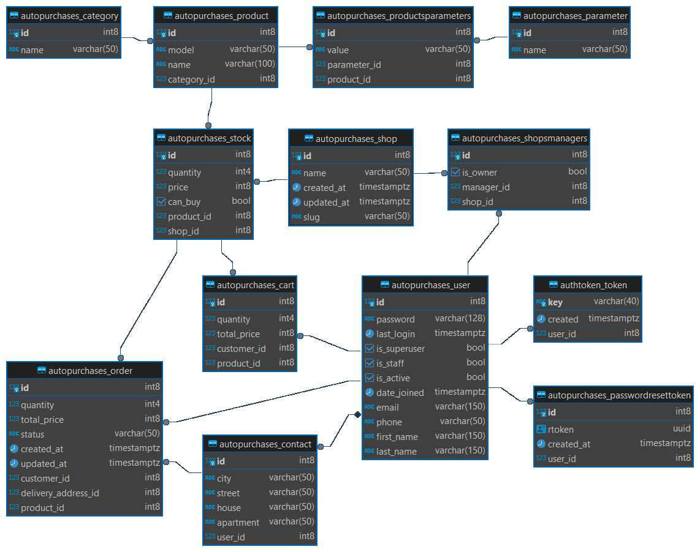

[](https://github.com/avsav1n/Autopurchases_app/actions)
[](https://coveralls.io/github/avsav1n/Autopurchases_app?branch=main)
[](LICENSE)

# [Дипломный проект профессии «Python-разработчик: расширенный курс»](https://github.com/netology-code/python-final-diplom)

## Backend-приложение для автоматизации закупок 

Приложение предназначено для автоматизации закупок в розничной сети через REST API.

###  👔 Пользователи сервиса:

1. Клиент (покупатель) может:  
* делать заказы по каталогу, в котором представлены товары от нескольких поставщиков;
* указать в одном заказе товары от разных поставщиков;
* авторизироваться, регистрироваться и восстанавливать пароль через API.
2. Поставщик может:
* через API информировать сервис об обновлении прайса;
* включать и отключать приём заказов;
* получать список оформленных заказов (с товарами из его прайса).

### 🛠️ Технологии:

* Python 3.12
* Django + Django REST Framework
* Celery 
* Pytest
* PostgreSQL
* Docker + Docker Compose
* GitHub Actions + Coveralls

### 🐳 Запуск приложения
1. Из папки с проектом перейти в директорию c конфигурацией `compose.yaml`
```bash
cd ./deploy/
```
2. Определить переменные окружения в файле `.env`, пример необходимых переменых в `.env.example` (частично предзаполнены)
3. Запустить приложение
```bash
docker compose up -d --build
```

### 🗄️ Схема базы данных:



### 🌐 Основные точки входа API:

> У всех URL используется префикс `/api/v1/`.  
Например: `http://localhost:8000/api/v1/login/`

#### 🕵 Пользователи, работа с профилем пользователя
|URL|Метод|Действие|Необходимые права|
|-|-|-|-|
|`/user/`|**GET**|Получение информации о всех зарегистрированных пользователях|Не требуются|
|`/user/<user.id>/`|**GET**|Получение информации о конкретном пользователе|Не требуются|
|`/user/`|**POST**|Регистрация нового пользователя|Не требуются|
---
Пример тела запроса:
```json
{
    "email": "admin@gmail.com",
    "password": "QWErty123",
    "phone": "+71234567890",  // опционально
    "first_name": "Ivanov",   // опционально
    "last_name": "Ivan"       // опционально
}
```
|||||
|-|-|-|-|
|`/user/<user.id>/`|**PATCH**|Изменение профиля пользователя|Владелец профиля или администратор|
|`/user/<user.id>/`|**DELETE**|Удаление профиля пользователя|Владелец профиля или администратор|
|`/user/<user.id>/contacts/`|**POST**|Создание и добавление информации о контакте пользователя (адреса)|Владелец профиля или администратор|
---
Пример тела запроса:
```json
{
    "city": "Moscow",
    "street": "Lesnaya",
    "house": 3,
    "apartment": 21  // опционально
}
```
|||||
|-|-|-|-|
|`/user/<int:user.id>/contacts/<int:contact.id>/`|**DELETE**|Удаление выбранного контакта пользователя (адреса)|Владелец профиля или администратор|
|`/user/reset/?email=<str:email>`|**GET**|Создание и получение токена сброса пароля|Не требуются|
|`/user/reset/confirm/`|**PATCH**|Сброс старого пароля пользователя и установка нового|Не требуются|
Пример тела запроса:
```json
{
    "rtoken": "123e4567-e89b-12d3-a456-426655440000",
    "password": "QWErty123"
}
```

#### 🔐 Авторизация
|URL|Метод|Действие|Необходимые права|
|-|-|-|-|
|`/login/`|**POST**|Получение токена|Не требуются|
---
Пример тела запроса:
```json
{
    "email": "admin@gmail.com",
    "password": "QWErty123"
}
```

#### 🏢 Магазины
|URL|Метод|Действие|Необходимые права|
|-|-|-|-|
|`/shop/`|**GET**|Получение информации обо всех магазинах|Не требуются|
|`/shop/<shop.slug>/`|**GET**|Получение информации о конкретном магазине|Не требуются|
|`/shop/`|**POST**|Регистрация нового магазина|Авторизован|
---
Пример тела запроса:
```json
{
    "name": "SHOP",
    "managers": [2, ...]  // опционально, пользователь регистрирующий магазин, будет всегда иметь статус владельца
}
```
|||||
|-|-|-|-|
|`/shop/<shop.slug>/`|**PATCH**|Изменение профиля магазина|Управляющий магазина или администратор|
|`/shop/<shop.slug>/`|**DELETE**|Удаление профиля магазина|Управляющий магазина или администратор|
|`/shop/import/`|**POST**|Регистрация нового магазина вместе со всем его ассортиментом|Авторизован|
---
> Инфомацию о магазине можно передать в теле запроса в форматах json или yaml, или файлом, аналогичных форматов.     

Пример тела запроса:
```json
{
    "shop": "SHOP",
    "products": [
        {
            "category": "Смартфоны",
            "model": "apple/iphone/xs-max",
            "name": "Смартфон Apple iPhone XS Max 512GB (золотистый)",
            "price": 110000,
            "quantity": 14, 
            "can_buy": true,  // опционально
            "parameters": {
                "Диагональ (дюйм)": "6.5",
                "Цвет": "золотистый",
                ...
            },
        },
        ...
    ]
}
```
```yaml
shop: TESTSHOP
products:
  - category: Смартфоны
    model: apple/iphone/xs-max
    name: Смартфон Apple iPhone XS Max 512GB (золотистый)
    price: 110000
    quantity: 14
    can_buy: true  # опционально
    parameters:
      "Диагональ (дюйм)": 6.5
      "Цвет": золотистый
      ...
  ...
```
|||||
|-|-|-|-|
|`/shop/<shop.slug>/export/`|**GET**|Запрос на выгрузку информации о магазине со всем его ассортиментом|Управляющий магазина или администратор|
|`/shop/<shop.slug>/orders/`|**GET**|Получение информации об активных/завершенных заказах выбранного магазина|Управляющий магазина или администратор|
|`/shop/<shop.slug>/orders/<order.id>/`|**PATCH**|Изменение статуса выбранного заказа|Управляющий магазина или администратор|
|`/shop/<shop.slug>/stock/<stock.id>/`|**PATCH**|Изменение информации о товаре на выбранном складе|Управляющий магазина или администратор|

#### 🥬 Работа с задачами Celery
|URL|Метод|Действие|Необходимые права|
|-|-|-|-|
|`/task/<task.id>/`|**GET**|Получение информации о статусе выполнения задачи|Не требуются|
|`/download/<task.id>/`|**GET**|Получение файла с данными о магазине|Не требуются|
---
> Требуемый формат файла (yaml или json) можно указать через заголовок Accept в запросе (по умолчанию yaml).

#### 📦 Каталог товаров
|URL|Метод|Действие|Необходимые права|
|-|-|-|-|
|`/stock/`|**GET**|Получение информации о магазинах, товарах, их характеристиках, количестве и стоимости|Не требуются|

#### 🗑 Работа с корзиной
|URL|Метод|Действие|Необходимые права|
|-|-|-|-|
|`/cart/`|**GET**|Получение информации о товарах в корзине|Авторизован|
|`/cart/<cart.id>/`|**GET**|Получение информации о конкретном товаре в корзине|Авторизован|
|`/cart/`|**POST**|Добавление товара в корзину|Авторизован|
---
Пример тела запроса:
```json
{
    "product": 2,
    "quantity": 2
}
```
|||||
|-|-|-|-|
|`/cart/<cart.id>/`|**PATCH**|Изменение информации о товаре в корзине|Владелец корзины|
|`/cart/<cart.id>/`|**DELETE**|Удаление товара из корзины|Владелец корзины|
|`/cart/confirm-order/`|**POST**|Заказ всех имеющихся товаров в корзине|Авторизован|
---
Пример тела запроса:
```json
{
    "delivery_address": {
        "city": "Moscow",
        "street": "Lesnaya",
        "house": 3,
        "apartment": 21  // опционально
    }
}
```
#### 🛒 Заказы
|URL|Метод|Действие|Необходимые права|
|-|-|-|-|
|`/order/`|**GET**|Получение информации об активных/завершенных заказах|Авторизован|
